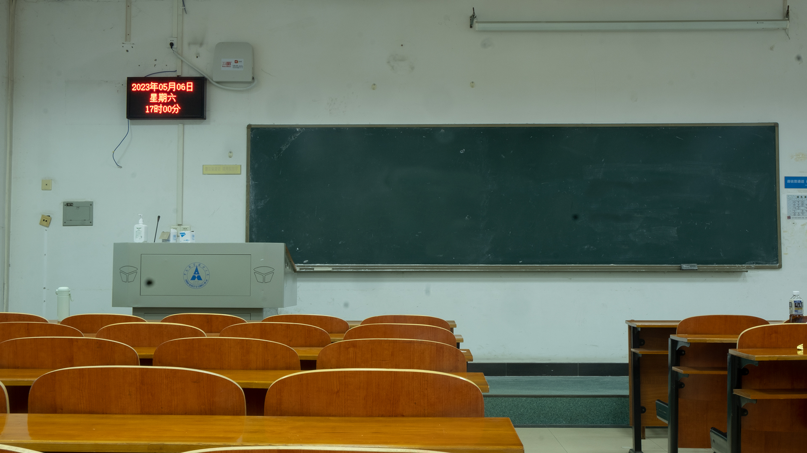

# 中南财经政法大学 `文波楼 208`

2023年5月6日,武汉,阴雨连绵.

重回母校中南财大,徐行至文波楼208教室.

趴在桌子上眯了一会.醒了之后,抬头环顾四周,除了黑板旁边的时间,其他一切似乎都没变.

**仿佛这一觉睡了7年.**

百感交集,想把此时此刻的心境留下来,传达给以后怀念的自己.

于是写了一个简单的网页.访问地址:

http://zhaoyanyun.com/zuel_classroom/

> 希济世，明文理
>
> 逐梦难追忆
>
> 南湖畔，晓风起
>
> 来年再相忆

at 2023.5.7 09:50 , 于武汉市 / 江岸区 / 解放公园旁

## Reference
* [中南财经政法大学版《南山南》music](http://www.zuel.edu.cn/services/#download)
* [中南财经政法大学版《南山南》lyric](http://wellan.zuel.edu.cn/2016/0111/c1679a33693/pagem.htm)
